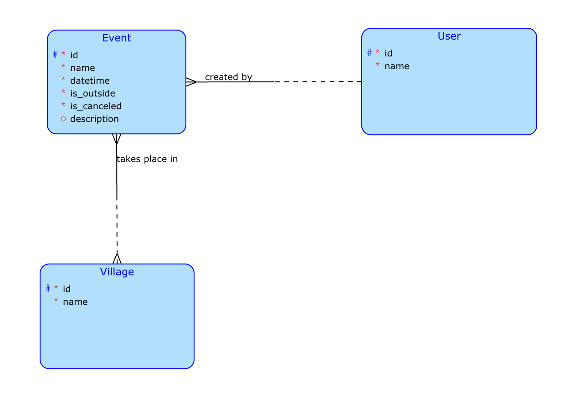

# District events

- Website for sharing upcoming events.

## Complex server query
- Select all events that match given name, village and date (ignore empty items).
- Select all events created by user.

## Client business operation

- Delete all canceled events created by signed user.
  - Get all user's events. (provided by server),
  - Go through them one by one and delete them if they are marked as canceled.

## Data model

## Frontend

- [Figma](https://www.figma.com/file/0NcVXePiftwx3kBkyfE1IS/District-Events?node-id=0%3A1)

